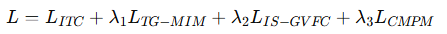

# (Step 1) Backbone kết hợp

## Mục tiêu của việc kết hợp
Kết hợp sức mạnh alignment và optimization của TBPS-CLIP với khả năng học chi tiết + ID calibration của VFE-TPS để tạo ra một mô hình vừa căn chỉnh cross-modal chính xác, vừa phân biệt người tốt hơn.

## 🧩 Tóm tắt pipeline luận văn gợi ý
- Load TBPS-CLIP (ViT-B/16) checkpoint
- Freeze image & text encoder trong vài epoch đầu (stabilize alignment).
- Add TG-MIM + IS-GVFC auxiliary branches
- Combine losses: 

- Train few-shot / zero-shot setting bằng meta-learning episodes.
- Evaluate trên unseen IDs (zero-shot) và few-sample IDs (few-shot).

### 1) Tóm tắt ngắn gọn về hai aux tasks
- **TG-MIM:** che patch ảnh, dùng text như key/value để cross-attention, rồi reconstruct pixel của patch bị mask (L1). Mục tiêu: ép encoder học **local visual cues liên quan đến truy vấn** (mà contrastive global thường bỏ qua).
- **IS-GVFC:** tính phân phối matching nội bộ (cosine → softmax) giữa tất cả global visual features trong batch, so sánh với phân phối ground-truth (IDs) bằng KL divergence. Mục tiêu: calibrate embedding space theo ID (kéo các mẫu cùng ID gần lại, đẩy các ID khác ra xa) mà không cần triplet mining.

### 2) Vì sao TBPS-CLIP có thể đã “lấp” nhiều lợi ích?
TBPS-CLIP (như bài empirical) đã:
- dùng nhiều biến thể contrastive (N-ITC, R-ITC, C-ITC),
- self-supervision (SS-I, SS-T),
- multi-view supervision (MVS),
- data augmentation và training tricks.

Những thứ này tối ưu mạnh cho:
- global alignment giữa image/text embeddings,
- robust hóa embedding chung (nhờ SS/MVS/aug),
- cải thiện Rank@1 trong cấu hình standard.

=> Hệ quả: một số lợi ích cơ bản mà TG-MIM/IS-GVFC nhắm tới (ví dụ, stability của embedding, robustness) có thể đã phần nào được TBPS-CLIP giải quyết.

### 3) Nhưng TG-MIM & IS-GVFC vẫn có khả năng bổ sung — lý luận chi tiết
**A. TG-MIM bổ sung gì mà TBPS-CLIP khó thay thế?**
- **Local task relevance (text→patch link)**: Contrastive losses tối ưu similarity toàn cục; SS/MVS tạo invariance nhưng không ép token/patch cụ thể phải liên quan tới từ cụ thể trong query. TG-MIM trực tiếp làm cho text hướng dẫn tái tạo patch, tức là nó dạy encoder mối liên hệ cục bộ giữa từ và vùng ảnh — hữu ích khi các cá nhân chỉ khác nhau ở chi tiết nhỏ (giày, balo, hoa văn).
- **Attention grounding**: TG-MIM thường sẽ khiến cross-attention trọng số nhạy hơn với từ quan trọng → cải thiện interpretability và giúp downstream retrieval khi câu truy vấn nhấn vào chi tiết.
- **Domain adaptation nhỏ**: Nếu CLIP pretraining dùng ảnh tự nhiên, TG-MIM trên dữ liệu pedestrian ép encoder thích nghi với phân phối pedestrian-specific local cues.

Khi TBPS-CLIP đã có SS/MVS, TG-MIM vẫn có thể cải thiện hard examples (những truy vấn cần local cues). Vài paper báo cáo tăng nhỏ nhưng ổn định ở subset “hard”.

**B. IS-GVFC bổ sung gì?**
- **Toàn cục nhưng theo ID distribution**: Contrastive ITC tối ưu image↔text match; nó không tối ưu trực tiếp rằng các ảnh cùng ID (nhiều camera/times) phải gần nhau trong không gian ảnh nội tại. IS-GVFC ép điều đó thông qua phân phối nội ảnh → giảm identity confusion (khi 2 người khác ID mặc đồ giống nhau).
- **Không cần mining/margin**: Triplet/contrastive pair mining có thể khó và nhạy. IS-GVFC tận dụng toàn bộ batch distribution, ổn định hơn khi batch composition đa dạng.
- **Complementary objective**: Nó là objective intra-modal (visual→visual) bổ sung cho inter-modal (visual↔text) của TBPS-CLIP.

**C. Khi 2 aux tasks khả có ích nhất**
- Datasets / queries với nhiều nhầm lẫn ID (quần áo giống, ánh sáng khác) → IS-GVFC hiệu quả.
- Truy vấn chú trọng chi tiết (color, small accessories) → TG-MIM hiệu quả.
- Domain shift (suy luận trên dữ liệu khác về style/camera) → TG-MIM có thể giúp encoder bắt chi tiết domain-specific; IS-GVFC giúp ổn định embedding.

### 4) Khi nào khả năng bổ sung nhỏ hoặc không đáng kể
- **TBPS-CLIP đã tối ưu triệt để và stacking many losses**: nếu TBPS-CLIP đã kết hợp R-ITC + SS-I + MVS-I + paraphrase augmentation và đã fine-tune kĩ, thì marginal gain từ TG-MIM/IS-GVFC có thể rất nhỏ (<<1% Rank@1).
- **Nếu test set đơn giản, không nhiều hard cases**, bạn sẽ khó thấy lợi ích.
- **Chi phí training tăng**: TG-MIM và IS-GVFC đều tăng overhead (TG-MIM: reconstruct decoder/conv head; IS-GVFC: compute full similarity matrix). Nếu tài nguyên hạn chế, overhead có thể không xứng đáng.

### 5) KẾ HOẠCH THÍ NGHIỆM (để đo chính xác hiệu quả) — bắt buộc cho luận văn

Thiết kế thí nghiệm phải trả lời: TG-MIM và IS-GVFC có mang lại cải tiến đáng kể so với TBPS-CLIP đã tối ưu không?

**A. Baselines**
- TBPS-CLIP (strong reimplementation) — reprod. best single-loss/stack combo (R-ITC + SS-I + MVS-I + augmentations) — gọi là Base.
- Base + TG-MIM
- Base + IS-GVFC
- Base + TG-MIM + IS-GVFC (full)
- (optional) VFE-TPS original and RaSa for comparison

**B. Datasets & splits**
- CUHK-PEDES (standard), RSTPReid (if available).
- Create "hard subset": queries where correct match is visually similar to distractors (same clothing color etc.). Evaluate separately.
- Open-set test (unseen domain / unseen ID split): test generalization.

**C. Metrics**
- Rank@1, Rank@5, mAP.
- Hard-case gain: ΔRank@1 on hard subset.
- Statistical test: run 3 seeds, report mean ± std, do paired t-test to verify significance (p<0.05).

**D. Computational cost reporting**
- Training time per epoch, total epochs to converge, GPU memory, inference latency.
- Compute efficiency vs gain tradeoff (e.g., %Rank1 gain per 10% more training time).

**E. Qualitative analysis**
- Visualize cross-attention maps for TG-MIM vs Base.
- Nearest neighbor in visual embedding space before/after IS-GVFC to see clustering.
- Failure case study.

**F. Hyperparameters to tune**
- Loss weights λ_TG, λ_IS; temperature τ for softmax; mask ratio for TG-MIM; batch size (IS-GVFC sensitive).
- Schedule: ramp up aux losses after warming up Base training (e.g., first 5–10 epochs freeze CLIP then enable TG-MIM).

### 6) Practical recommendations (implementation & training strategy)
- Start from TBPS-CLIP checkpoint (fast, less risky).
- Phase training:
    - Phase 1 (warm-up): train only contrastive (R-ITC/C-ITC) + SS/MVS as in TBPS-CLIP for stability (5–10 epochs).
    - Phase 2: enable IS-GVFC with small weight λ_IS = 0.05 → 0.2 (tune). Batch size large (B ≥ 64) to have many pairwise comparisons. Temperature τ same as ITC (0.07–0.2).
    - Phase 3: enable TG-MIM with λ_TG = 0.1 (tiny to start). Mask ratio = 0.3–0.5; reconstruction head light (Conv2D+PixelShuffle). Use L1 loss. After stable, possibly unfreeze few encoder layers.
    - Phase 4: final joint fine-tune, tune λs by grid search (λ_IS ∈ {0.05,0.1,0.2}; λ_TG ∈ {0.05,0.1,0.2}).
- Batch size: IS-GVFC benefits from larger batch (better estimation of distribution) — try to maximize batch size within memory.
- Compute budget: measure tradeoff; if TG-MIM adds >>20–30% train time but only +0.2% Rank@1, consider removing.
- Hyperparam gợi ý
    - temperature τ (contrastive) = 0.07 (CLIP default) → tune 0.05–0.2
    - batch size = as large as memory allows (≥64 recommended for IS-GVFC)
    - mask ratio (TG-MIM) = 30–50%
    - TG-MIM reconstruction loss = L1; learning rate for decoder head 1e-4, for encoders 1e-5 (if fine-tuning)
    - IS-GVFC uses KL between p and q; q is normalized per anchor over same-ID entries.

### 7) Expected effect sizes (practical guidance) [ablation]
- If TBPS-CLIP Base is well-tuned, typical realistic gains:
    - Base + IS-GVFC: +0.3% … +1.5% Rank@1 on general set; larger (+1–3%) on hard subset.
    - Base + TG-MIM: +0.2% … +1.5% Rank@1 overall; larger on queries needing local cues.
    - Both combined: effects may be additive for hard cases; overall ΔRank@1 maybe ~0.5–3% depending on dataset difficulty.
- If Base is weaker (no SS/MVS), gains can be larger.

Những con số trên là ước lượng dựa trên lý luận và kinh nghiệm trong literature (not exact). Độ tin cậy phụ thuộc vào dataset và reimplementation quality.

### 8) Các rủi ro & mitigations
- Rủi ro: Overfitting aux tasks (TG-MIM reconstructs uninformative pixels) → giảm cross-modal alignment.
- Mitigate: use small λ_TG, early stopping on retrieval metric, mask ratio tuning.

- Rủi ro: IS-GVFC bị batch-biased (batch composition ảnh hưởng phân phối).
- Mitigate: ensure batch sampling includes multiple IDs, shuffle; test sensitivity to batch size.

- Rủi ro: Training time blowup.
- Mitigate: phase enabling, lightweight decoder head, mixed precision.

### 9) Kết luận & khuyến nghị tóm tắt
- Lý luận: TG-MIM và IS-GVFC có thể mang lại giá trị bổ sung đối với một TBPS model đã mạnh như TBPS-CLIP, nhưng lợi ích thực tế phụ thuộc mạnh vào:
    - chất lượng baseline (Base đã được tuned thế nào),
    - tỷ lệ hard cases trong dataset,
    - tài nguyên tính toán và cách tích hợp (loss weighting, schedule).
- Chiến lược thực nghiệm tối ưu cho luận văn: bắt đầu từ TBPS-CLIP checkpoint, làm controlled ablations (Base → +IS → +TG → +Both), report gains overall + on hard subset + cost metrics, và kèm visualization.
- Nếu bạn cần recommendation duy nhất: làm theo pipeline fine-tune (không train từ đầu), tune weights nhỏ, báo cáo tradeoff; chỉ tiến tới training from scratch nếu bạn có thời gian/GPU dư dả.